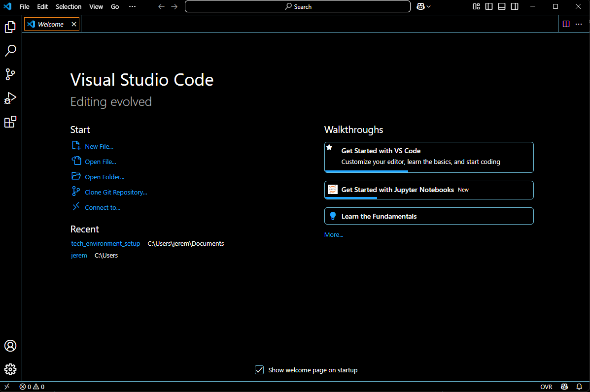

# tech_environment_setup
This project is includes my completions of the all the activities included in the comprehensive installation guide for setting up the tech environment.

##

### VS Code Welcome Screen

##

### Git -- Version confirmation

##

### VirtualBox Welcome Screen

##

### Ubuntu Login Prompt

##

### Github Dashboard

##

### AWS management console

 ##

